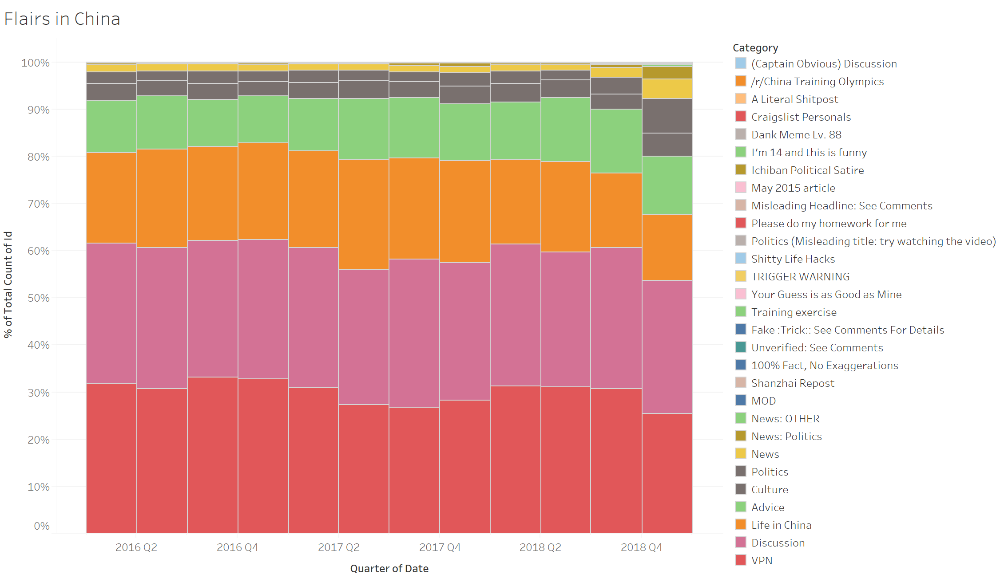
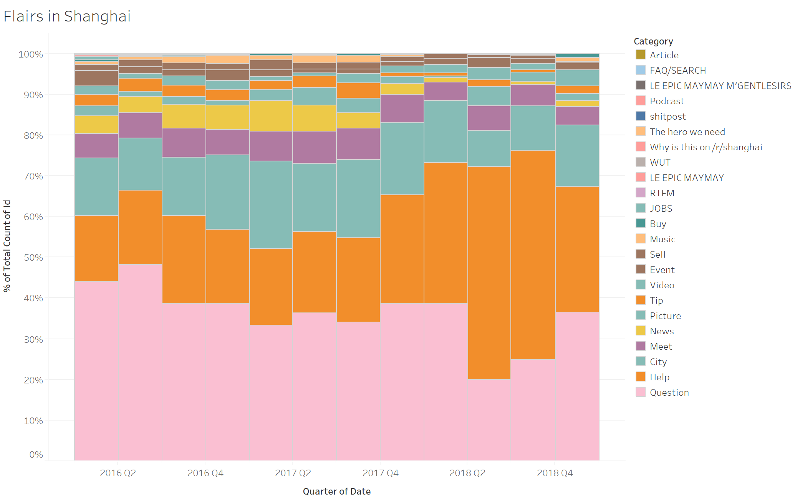
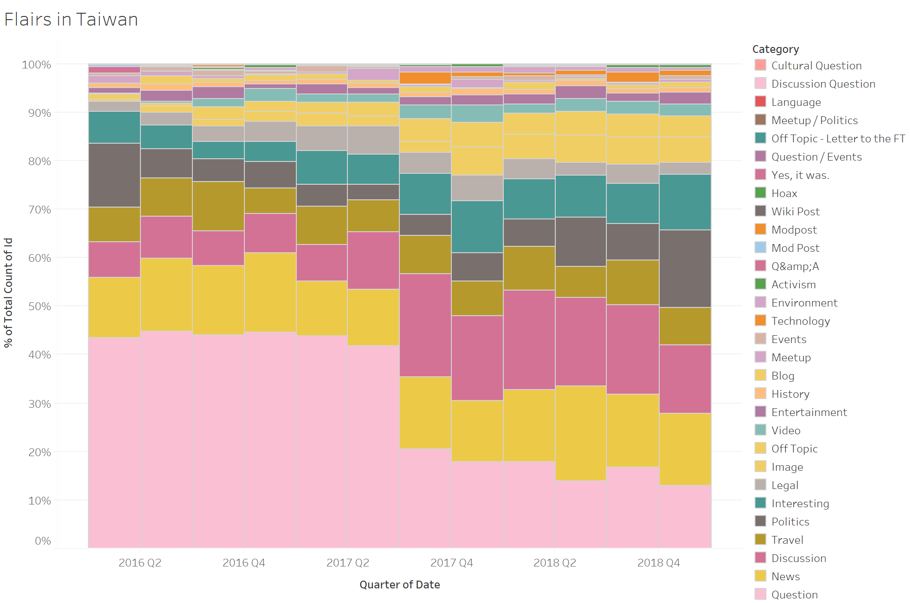

## Background

Reddit is an online discussion board with a majority of its users from Western countries (most of whom North Americans). Threads belong to various "subreddits" based on topics, and there are five most active subreddits focusing on the Greater China Region: [r/china](https://reddit.com/r/china), [r/beijing](https://www.reddit.com/r/beijing), [r/shanghai](https://www.reddit.com/r/shanghai), [r/HongKong](https://www.reddit.com/r/HongKong), and [r/taiwan](https://www.reddit.com/r/taiwan).

Authors of this project are international (Chinese) students in the US, interested in foreigners' opinion about China and the broader Greater China Region. They decide to use techniques from their Text Mining class, and explore topics in the aforementioned subreddits.

## Objective(s) and methodology

- Supervised learning - tagging posts with "link flairs"

Some posts have been tagged by their OP with "flairs", which is Reddit's way of saying tags. We use those as training/testing dataset to train a Naive Bayes classifier, then use it to tag untagged posts. Choice of using Naive Bayes, rather than Support Vector Machine or other classifiers, is due to one author being a firm proponent of Bayesian statistics.

There was discussion within the group, on whether a single model should be trained on all subreddits, or separate models for each subreddit. Argument for the first approach included:

  1. More data could improve model accuracy;
  2. It should be safe to assume that different subreddits had similar language pattern for the same topic.

Argument for the second approach included:

  1. Different subreddits used different tags for similar topics. Modeling them altogether would force the model to differentiate among those, which made no sense.

We proceeded with the second approach, separate models for each subreddit.

- Unsupervised learning - topic modeling with LDA

To quote Spark's [documentation](https://spark.apache.org/docs/2.2.0/mllib-clustering.html#latent-dirichlet-allocation-lda), Latent Dirichlet Allocation (**LDA**) is a topic model which infers topics from a collection of text documents. LDA can be thought of as a clustering algorithm as follows:

    - Topics correspond to cluster centers, and documents correspond to examples (rows) in a dataset.
    - Topics and documents both exist in a feature space, where feature vectors are vectors of word counts (bag of words).
    - Rather than estimating a clustering using a traditional distance, LDA uses a function based on a statistical model of how text documents are generated.

> ### Why still use LDA when we have tagged the posts?
> We want to have our own understanding of the topics, not necessarilly limited to existing flairs. In addition, we find flairs not an **MECE** (Mutually Exclusive, Collectively Exhaustive) representative of topics, not to mention that not all subreddits support flairs.

## Technologies and reasons of choice

- Microsoft Azure
  - Data Factory, for ETL `ndjson` into SQL Database. This tool has an easy-to-use GUI to compose pipelines, much like SQL Server Integration Service (**SSIS**). It is *hard* to debug, however.
  - SQL Database. We choose to use traditional relational database management system (**RDBMS**) because we need to *join* posts with comments, as well as filtering on various columns. There is no obvious advantage of using a document database (e.g. MongoDB), only obvious *disadvantages*.
  
- Apache Spark (on Azure HDInsight). Apache Spark provides various machine learning algorithms out-of-the-box. It also scales well for compute-and-memory-intensive tasks, like LDA (mentioned below).

- NLTK (Natural Language ToolKit). There are many fancy NLP packages, however NLTK still does a good job cleaning and tokenizing the corpus.

## Data and pre-processing

Jason maintains [a regularly updated repository](https://files.pushshift.io/reddit/) of Reddit data, organized by time. However, since this analysis only requires a small number of subreddits, we choose to use [the pre-made BigQuery dataset](https://www.reddit.com/r/bigquery/comments/3cej2b/17_billion_reddit_comments_loaded_on_bigquery/), which makes filtering based on subreddit a breeze.

For the sake of this project, we exclude "link" posts and posts without any comments, based on two considerations:

1. We need to follow the link and scrape the website in order to know what the link is about. Scraping exposes us to great legal risk.
2. Posts without comments are often too short for analysis; we also deem those as "not interested by others", thus of little value for understanding the mainstream opinion.
 
We then concatenate comments with the main post to form a single "document" for each thread, using *SQL*:

```sql  
select id, subreddit, score, author, created_utc, body + cmt as body, author_flair_text, link_flair_text into documents 
from (
  select posts.*, string_agg(comments.body,'.') as cmt 
  from posts 
  join comments on posts.subreddit = comments.subreddit and posts.id = comments.parent
  group by posts.id, posts.subreddit, posts.score, posts.author, posts.created_utc, posts.body, posts.author_flair_text, posts.link_flair_text
) as p; -- String_agg is a function on SQL Server 2017. In previous versions you might need to use some function like xml_path.
```

> ### Why use SQL for concatenation?
> SQL is not commonly used for this type of tasks, and the authors do have a few options, including writing their own Python script (they are most familiar with Python). However, they believe using a native function in RDBMS has a performance advantage because DBMS is written in C++ and highly optimized (batch operation, parallelism, etc.).

## Result

- Supervised learning - tagging posts with "link flairs"

> How to read the chart - some colors might look similar to human eyes. However, for most not-very-short bars, the order of them in the chart is the same as order of color blocks in the legend.

  * China



The proportion of each flair under subreddit China has been consistent from 2016 to 2018. The most popular flairs in subreddit China were: VPN, Discussion, Life in China, Advice and News.

  * Shanghai



Proportion of each flair under subreddit Shanghai from 2016 to 2018 is not as consistent as that in subreddit China. Some flairs become more popular in 2018, such as Help, while other flairs attracted less attention, such as Question, City, and Music. Share of flairs like Meet has been stable over years. Overall, most popular flairs in subreddit Shanghai were: Question, Help, City, Meet, and News.  

  * Taiwan



Flairs under subreddit Taiwan is much more diverse compared to China and Shanghai. Share of each flair has been dynamically changing from 2016 to 2018. Overall, most popular flairs in Taiwan were: Question, Discussion, News, Travel, and Politics.

- Unsupervised learning - topic modeling with LDA

> Please note that labeling each topic is a manual process, thus it is very hard to be consistent across subreddits and quarters. As a result, you might find similar topics in different words.

  * China

Subreddit China became a more vibrant community from 2016 to 2018 since wider topics were discussed. The most frequent topics were: Travel, VPN, WeChat, Politics and Foreigners in China.

Detailed dominant topics by quarter:

| Subreddit | Year | Quarter | Topics |
| --------- | ---- | ------- | ------ |
| China | 2016 | 1 | Travel |
| China | 2016 | 2 | Travel |
| China | 2016 | 3 | Travel |
| China | 2016 | 4 | Travel |
| China | 2017 | 1 | Travel, City, Politics, Work, Transportation, US-Japan relation |
| China | 2017 | 2 | Foreigner's Life in China, Taiwan, VPN, [Daigou](https://en.wikipedia.org/wiki/Daigou) |
| China | 2017 | 3 | University, Food Safety, Security Check, India, VPN |
| China | 2017 | 4 | Taiwan, VPN, Hong Kong Government, WeChat, Xinjiang |
| China | 2018 | 1 | Hong Kong School, China - Taiwan - US, Democracy, Foreigners in China |
| China | 2018 | 2 | China - Taiwan, Foreigners in China, China - US, Finance |
| China | 2018 | 3 | Xi Jinping, Passport, Xinjiang, Visa, Taiwan |
| China | 2018 | 4 | China - Hong Kong - Taiwan, Huawei, Trump, Real Estate, VPN, WeChat |

  * Beijing

2017 was the most active year for this subreddit. Most common topics here were: Travel, Work, VPN and Politics.

Detailed dominant topics by quarter: 

| Subreddit | Year | Quarter | Topics |
| --------- | ---- | ------- | ------ |
| Beijing | 2016 | 1 | Travel |
| Beijing | 2016 | 2 | Travel |
| Beijing | 2016 | 3 | Travel |
| Beijing | 2016 | 4 | Travel |
| Beijing | 2017 | 1 | Travel |
| Beijing | 2017 | 2 | Chinese SIM Card, Taiwan Food, VPN, Lifestyle, Hong Kong - China   |
| Beijing | 2017 | 3 | China - Hong Kong - Taiwan, VPN, Traffic, Flight, Visa |
| Beijing | 2017 | 4 | Work in China, VPN, Hong Kong - China, Traffic, Pollution |
| Beijing | 2018 | 1 | Travel |
| Beijing | 2018 | 2 | Travel, Work |
| Beijing | 2018 | 3 | Attractions |
| Beijing | 2018 | 4 | Attractions |

  * Shanghai

Subreddit Shanghai was more vigorous than the previous two subreddits. Top 5 topics from 2016 to 2018 were: Economy, Social life, WeChat, Travel, and Language.

Detailed dominant topics by quarter: 

| Subreddit | Year | Quarter | Topics |
| --------- | ---- | ------- | ------ |
| Shanghai | 2016 | 1 | Work, Safety, Economy, Language |
| Shanghai | 2016 | 2 | Food, City Life, Finance, Language, Travel |
| Shanghai | 2016 | 3 | Travel, Social Life, Language, Economy, Housing |
| Shanghai | 2016 | 4 | Lifestyle, Shopping, Work, Economy |
| Shanghai | 2017 | 1 | Shopping, Travel, Lifestyle |
| Shanghai | 2017 | 2 | Social Life, Night Life   |
| Shanghai | 2017 | 3 | Social Life, WeChat, Economy, Work, Travel |
| Shanghai | 2017 | 4 | Food, Attractions, WeChat |
| Shanghai | 2018 | 1 | Language, WeChat, Shopping, Food |
| Shanghai | 2018 | 2 | Language, Food, Social Life, Shopping |
| Shanghai | 2018 | 3 | Food, WeChat, Work |
| Shanghai | 2018 | 4 | City Life, Food, Attractions, WeChat |

  * Hong Kong

"China - Hong Kong (relation)" appeared in almost every quarter. Other than this, Work, Economy, Shopping and Language were also hot topics from 2016 to 2018 under subreddit Hong Kong.

Detailed dominant topics by quarter: 

| Subreddit | Year | Quarter | Topics |
| --------- | ---- | ------- | ------ |
| Hong Kong | 2016 | 1 | Food, Work, Language, Education, China - Hong Kong, MTR  |
| Hong Kong | 2016 | 2 | Lifestyle, Language, China - Hong Kong, Shopping, Work, Culture, Entertainment |
| Hong Kong | 2016 | 3 | Travel |
| Hong Kong | 2016 | 4 | Travel |
| Hong Kong | 2017 | 1 | Work, Local Life, Economy, Policy |
| Hong Kong | 2017 | 2 | Work, China - Hong Kong, Economy, Shopping |
| Hong Kong | 2017 | 3 | China - Hong Kong, Student - Government |
| Hong Kong | 2017 | 4 | China - Hong Kong, Economy, Food |
| Hong Kong | 2018 | 1 | Language, Students, Food, Attractions, Social Life |
| Hong Kong | 2018 | 2 |  Work, Economy, China - Hong Kong |
| Hong Kong | 2018 | 3 | Typhoon, Work, China - Hong Kong, Language |
| Hong Kong | 2018 | 4 | Social Life, Chinese, Transportation |

  * Taiwan

Just like subreddit Hong Kong, topic China - Taiwan (relation) appeared almost in every quarter from 2016 to 2018. Besides, Night Market, Politics, Language, Food, and Taipei were also frequently discussed under subreddit Taiwan. This subreddit was the most vigorous among all five in respect to diversity of topics.

Detailed dominant topics by quarter: 

| Subreddit | Year | Quarter | Topics |
| --------- | ---- | ------- | ------ |
| Taiwan | 2016 | 1 | Night Market, China - Taiwan, Chinese Tourist, Lifestyle, Food, Politics |
| Taiwan | 2016 | 2 | Travel, China - Taiwan - US, Economy, Language |
| Taiwan | 2016 | 3 | Travel, Politics, Restaurant, Taipei |
| Taiwan | 2016 | 4 | Travel, Finance, Taipei, China - Taiwan - US|
| Taiwan | 2017 | 1 | Travel, Night Market, China - Taiwan - Japan, China - Taiwan, Taichung, Transportation|
| Taiwan | 2017 | 2 | Taiwan - US, Phone, Kaoshiung, Food, Language |
| Taiwan | 2017 | 3 | Language, Food, Taipei, Work |
| Taiwan | 2017 | 4 | Language, Night Market, China - Taiwan, Taipei |
| Taiwan | 2018 | 1 | Food, Language, China - Taiwan, Work, Taipei, Law |
| Taiwan | 2018 | 2 | Culture, China - Taiwan, Student|
| Taiwan | 2018 | 3 | Work, Mandarin, Politics, China - Taiwan, School, Students |
| Taiwan | 2018 | 4 | Food, Politics, China - Taiwan, Election, International Politics |

## Conclusion and discussion

Coming from a Chinese background, we confirm that topics on reddit are a fair representation of everyday life in China. For example, VPN is frequently mentioned under subreddit China and Beijing, whereas it is not as popular under subreddit Hongkong and Taiwan, where the Internet is not censored. Also, we are not surprised to see more discussion about politics in Beijing, whereas people talk about economy in Shanghai, which agrees with people's impression that Beijing is the political center, and Shanghai is the economic center of China.

## Contact

Code and technical details can be found in the companion repository of this page, under `master` branch. Questions and discussions can be raised using GitHub's issue system. 

> Disclaimer: Mention of a brand, product, or service does not suggest any endorsement by the authors.